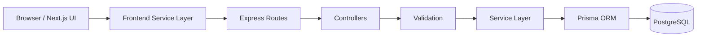
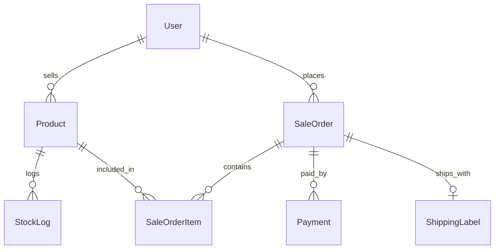

# Storemesh Developer Assessment Submission

## Live Demo
[Open Frontend Live Demo](https://YOUR-VERCEL-URL.vercel.app)

## Project Overview
Storemesh is a full-stack e-commerce assessment project that demonstrates buyer registration, product management, stock control, ordering, payment recording, and shipping workflows.

## Tech Stack / Software Components
- Frontend: Next.js 15, TypeScript, Tailwind CSS, Auth.js (NextAuth v5)
- Backend: Node.js, Express.js, Prisma ORM, TypeScript
- Database: PostgreSQL
- Runtime/Tools: Docker (database/backend option), npm, Prisma CLI

## System Architecture


## ER Diagram


## API Lifecycle
Client Request -> Route -> Controller -> Validation -> Service -> Prisma -> PostgreSQL -> JSON Response

## Product API Explanation
The Product API allows browsers to fetch listing-ready product data including:
- product image
- product title
- unit price

Primary endpoints:
- `GET /api/products`
- `GET /api/products/:id`
- `POST /api/products`

## Key API Examples
### `GET /api/products`
```json
{
  "success": true,
  "data": [
    {
      "id": 1,
      "image": "https://images.unsplash.com/photo-1511707171634-5f897ff02aa9",
      "title": "Wireless Headphones",
      "unitPrice": 89.99
    }
  ]
}
```

### `POST /api/auth/google/register`
```json
{
  "googleId": "google_123",
  "providerAccountId": "google_123",
  "email": "user@example.com",
  "username": "Demo User",
  "address": "12 Lake Rd, Springfield"
}
```

### `POST /api/orders/:id/shipping-label`
```json
{
  "recipientAddress": "12 Lake Rd, Springfield",
  "trackingNo": "TRK-TEST-001"
}
```

### `GET /api/orders/:id/shipping-label/print`
Returns a print-ready HTML shipping label page that sellers can print and attach to parcel boxes.

## Google Registration Flow
1. User signs in with Google in frontend (Auth.js).
2. Frontend obtains authenticated Google session/profile.
3. Frontend calls `POST /api/auth/google/register`.
4. Backend performs idempotent upsert by `googleId/providerAccountId` or `email`.
5. User record is created/updated with default `BUYER` role for new accounts.
6. If address is missing, frontend routes user to complete address form.

## Shipping and Inventory Workflow
1. Buyer creates order (`POST /api/orders`) with stock validation only.
2. Seller creates shipping label (`POST /api/orders/:id/shipping-label`).
3. Seller opens print view (`GET /api/orders/:id/shipping-label/print`) and prints the label.
4. During shipping transaction:
   - shipping label is created
   - inventory quantities are reduced
   - stock logs are written
   - order status is updated to `SHIPPED`

## Screenshots (Placeholders)
- Home / Product listing screenshot
- Product detail screenshot
- Login (credentials + Google) screenshot
- Seller dashboard screenshot
- Shipping/payment API test screenshot

## How to Run
1. Install dependencies for frontend and backend.
2. Start PostgreSQL (Docker or local).
3. Run Prisma generate/migrate and seed in backend.
4. Start backend on `http://localhost:5000`.
5. Start frontend on `http://localhost:3000`.
6. Test login + product + order + shipping + payment flows.

## Conclusion
The implementation satisfies the required buyer, seller, product, order, payment, shipping, and documentation flows with a clean layered architecture and assessment-ready API design.
